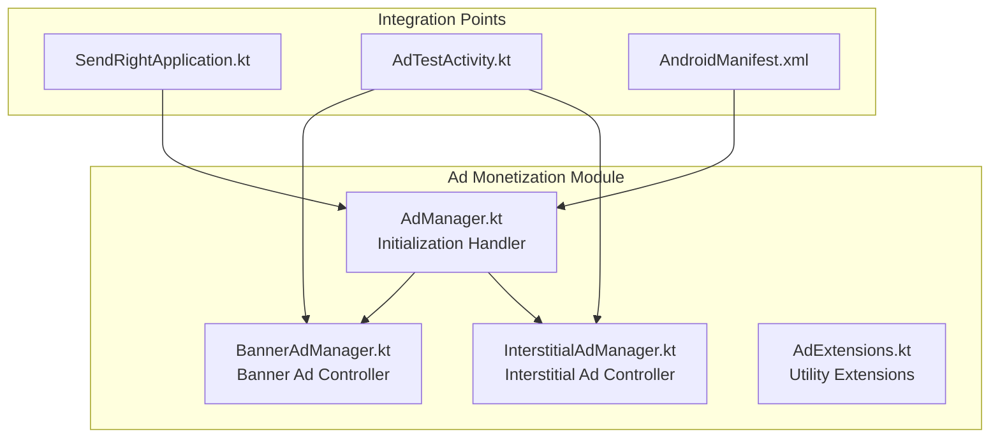
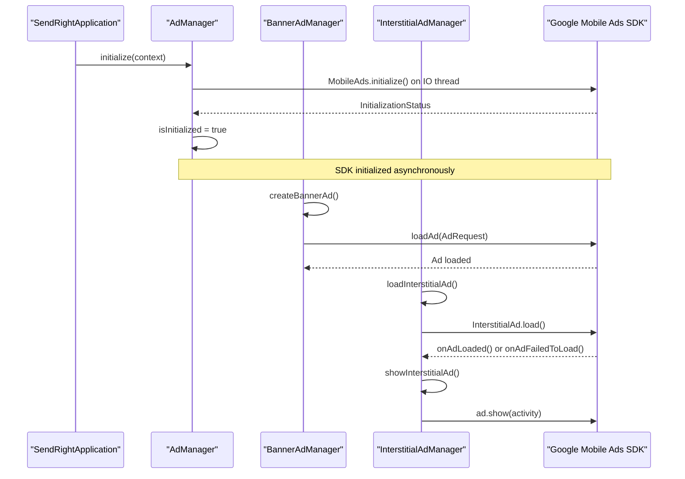

# AdMob Integration Guide for SendRight

This document provides comprehensive documentation for the AdMob integration in SendRight, an AI-enhanced Android keyboard application built on FlorisBoard.

## Table of Contents
1. [Introduction](#introduction)
2. [Project Structure](#project-structure)
3. [Core Components](#core-components)
4. [Architecture Overview](#architecture-overview)
5. [Detailed Component Analysis](#detailed-component-analysis)
6. [Dependency Analysis](#dependency-analysis)
7. [Performance Considerations](#performance-considerations)
8. [Troubleshooting Guide](#troubleshooting-guide)
9. [Conclusion](#conclusion)

## Introduction

This document provides comprehensive documentation for the AdMob integration in SendRight, an AI-enhanced Android keyboard application built on FlorisBoard. The monetization system leverages Google AdMob to display banner and interstitial advertisements within the application. This guide covers the implementation details, configuration requirements, best practices for ad placement, setup instructions, and troubleshooting tips.

## Project Structure

The AdMob integration is organized within a dedicated `ads` package under the `lib` directory. This modular structure separates ad-related functionality from core application logic, promoting code reusability and maintainable design. The ad system components are located in `app/src/main/kotlin/com/vishruth/sendright/lib/ads/`, containing specialized classes for different ad types and initialization management.



## Core Components

The AdMonetization system in SendRight consists of several core components that work together to provide a robust advertising solution. These components include the AdManager for SDK initialization, BannerAdManager for display banner advertisements, InterstitialAdManager for full-screen interstitial ads, and supporting utility classes. The design follows a manager pattern where each component has a specific responsibility, ensuring separation of concerns and ease of maintenance. All ad operations are designed to be non-blocking, with asynchronous initialization and loading processes that do not impact the main application performance.

## Architecture Overview

The AdMonetization architecture follows a layered approach with clear separation between initialization, ad management, and presentation layers. The system is initialized at the application level through the SendRightApplication class, which calls the AdManager to initialize the Google Mobile Ads SDK. Once initialized, various ad managers can be used throughout the application to display different types of ads.



## Detailed Component Analysis

### AdManager Analysis

The AdManager is a singleton object responsible for initializing the Google Mobile Ads SDK. It ensures that initialization occurs only once during the application lifecycle, preventing redundant initialization calls that could impact performance. The initialization process runs on a background thread using Kotlin coroutines, specifically on the IO dispatcher, to avoid blocking the main thread. This asynchronous approach ensures that the UI remains responsive during the initialization process, which may take some time depending on network conditions.

```mermaid
classDiagram
class AdManager {
-isInitialized : Boolean
+initialize(context : Context) : Unit
+isInitialized() : Boolean
}
note right of AdManager
Singleton object for AdMob
initialization management
Uses CoroutineScope(Dispatchers.IO)
for non-blocking initialization
end note
```

### BannerAdManager Analysis

The BannerAdManager class handles the creation and management of banner advertisements in the SendRight application. It provides a simple interface for creating banner ads with configurable ad unit IDs, with a default test ad unit for development purposes. The manager creates AdView instances, configures them with the appropriate ad size (BANNER), and loads advertisements using AdRequest objects. It also provides lifecycle management methods (resume, pause, destroy) that should be called from the corresponding Activity lifecycle methods to properly manage ad resources and prevent memory leaks.

```mermaid
classDiagram
class BannerAdManager {
-context : Context
-adView : AdView?
-TEST_BANNER_AD_UNIT_ID : String
+createBannerAd(adUnitId : String?) : AdView
+addBannerAdToView(parent : ViewGroup, adUnitId : String?) : AdView
+resume() : Unit
+pause() : Unit
+destroy() : Unit
}
note right of BannerAdManager
Manages banner ad lifecycle
Provides methods for creating
and adding banner ads to views
Includes proper resource cleanup
end note
```

### InterstitialAdManager Analysis

The InterstitialAdManager class manages full-screen interstitial advertisements, which are typically displayed at natural transition points in the application flow. Unlike banner ads, interstitial ads require explicit loading before they can be displayed. The manager uses a callback-based approach to notify when ads are loaded or fail to load, allowing for proper handling of asynchronous operations. It also provides a fullScreenContentCallback to monitor the ad's lifecycle events, such as when it is shown, dismissed, or fails to display. The showInterstitialAd method returns a boolean indicating whether the ad was successfully shown, enabling conditional logic in the calling code.

```mermaid
classDiagram
class InterstitialAdManager {
-context : Context
-interstitialAd : InterstitialAd?
-adUnitId : String
-adLoadCallback : ((InterstitialAd?) -> Unit)?
+setAdUnitId(adUnitId : String) : Unit
+loadInterstitialAd(callback : ((InterstitialAd?) -> Unit)?) : Unit
+showInterstitialAd(onAdClosed : (() -> Unit)?) : Boolean
+isAdLoaded() : Boolean
}
note right of InterstitialAdManager
Handles full-screen interstitial ads
Uses callback pattern for async loading
Provides lifecycle monitoring
Returns success status when showing ads
end note
```

## Dependency Analysis

The AdMob integration requires the Google Mobile Ads SDK dependency to be added to the project. This is accomplished by adding the following dependency to the app-level build.gradle.kts file:

```kotlin
implementation("com.google.android.gms:play-services-ads:24.6.0")
```

In the SendRight project, this dependency is managed through the version catalog system in libs.versions.toml. The version is defined as `google-mobile-ads = "24.6.0"` and referenced in the app's build.gradle.kts file as `implementation(libs.google.mobile.ads)`.

## Performance Considerations

The AdMonetization implementation in SendRight incorporates several performance optimizations to ensure a smooth user experience. The most significant optimization is the asynchronous initialization of the Google Mobile Ads SDK, which occurs on a background thread using Kotlin coroutines. This prevents the main UI thread from being blocked during the initialization process, which could otherwise cause application lag or ANR (Application Not Responding) errors. Banner ads are designed to be lightweight and are managed with proper lifecycle methods (resume, pause, destroy) to prevent memory leaks and excessive resource consumption. Interstitial ads are pre-loaded asynchronously, allowing them to be displayed quickly when needed without introducing delays in the user experience. The implementation also includes proper error handling and logging to help identify and resolve performance issues during development and production.

## Troubleshooting Guide

Common issues with the AdMonetization system typically fall into several categories: initialization problems, ad loading failures, and display issues. For initialization problems, ensure that the AdManager.initialize() method is called in the SendRightApplication class and that the AdMob App ID is correctly specified in the AndroidManifest.xml file. Ad loading failures are often caused by incorrect ad unit IDs, lack of internet connectivity, or improper test ad configuration. Display issues with banner ads may occur if the lifecycle methods (resume, pause, destroy) are not properly called from the hosting Activity. For interstitial ads, ensure that ads are loaded before attempting to display them, as calling showInterstitialAd() on a null ad reference will fail silently. The AdTestActivity can be used to verify that the ad integration is working correctly in a controlled environment.

## Conclusion

The AdMonetization system in SendRight provides a comprehensive solution for integrating Google AdMob advertisements into the keyboard application. The architecture is well-structured with clear separation of concerns, making it easy to maintain and extend. The implementation follows best practices for mobile advertising, including asynchronous initialization, proper lifecycle management, and comprehensive error handling. By leveraging the manager pattern and Kotlin's coroutine system, the solution ensures optimal performance and responsiveness. The inclusion of a dedicated test activity and thorough documentation further enhances the maintainability of the system. For production deployment, developers should replace the test ad unit IDs with their own AdMob credentials and ensure compliance with AdMob's policies regarding ad placement and user experience.