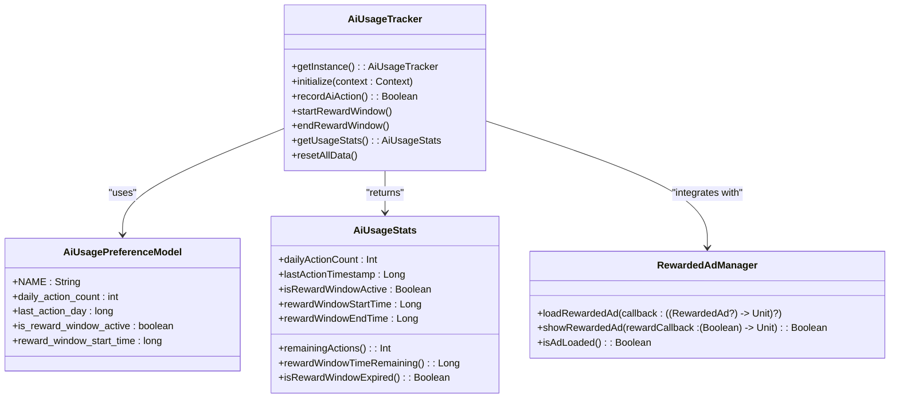

# AI Usage Tracking System

This document provides comprehensive documentation for the AI usage tracking system in SendRight, which manages daily AI action limits and reward windows.

## Table of Contents
1. [Introduction](#introduction)
2. [System Overview](#system-overview)
3. [Core Features](#core-features)
4. [Technical Implementation](#technical-implementation)
5. [Integration Guide](#integration-guide)
6. [Privacy Considerations](#privacy-considerations)

## Introduction

The AI Usage Tracking System in SendRight manages user access to AI-powered features while providing a sustainable monetization model through rewarded ads. The system enforces a daily limit on AI actions and offers users the ability to unlock temporary unlimited access by watching rewarded ads.

## System Overview

The system implements the following usage model:
- **Daily Free Usage**: 5 AI action requests per day
- **Limit Reached**: Show ad prompt to unlock 60 minutes of unlimited AI
- **Rewarded Window**: Watching 1 ad = 60 minutes unlimited AI requests
- **Reset**: After 60 minutes, usage resets to 0 credits
- **Repeatable**: User can watch another ad after window expires

## Core Features

### Daily Usage Limit
- Tracks daily AI action count using persistent storage
- Resets count automatically at midnight each day
- Applies to all Magic Wand features (Rewrite, Summarise, Chat, etc.)

### Reward Windows
- 60-minute unlimited AI action periods
- Activated via rewarded ads
- Automatically expires after 60 minutes
- Can be manually ended by restarting the keyboard

### Usage Statistics
- Real-time tracking of daily usage
- Reward window status and timing
- Remaining action count display
- Time remaining in active reward windows

## Technical Implementation

### Data Storage
The system uses JetPref to store usage data in a separate datastore named "ai-usage-prefs" with the following values:
- **daily_action_count** (int): Current day's action count
- **last_action_day** (long): Timestamp of the last action day
- **is_reward_window_active** (boolean): Whether reward window is currently active
- **reward_window_start_time** (long): Start time of the current reward window

### Key Components
1. **AiUsageTracker.kt**: Singleton manager class that handles all tracking logic
2. **AiUsagePreferenceModel**: JetPref datastore model for persistent storage
3. **AiUsageStats**: Data class for holding current usage information
4. **MagicWandPanel.kt**: UI integration for displaying usage information and reward window controls

### Class Diagram


### Usage Flow
1. User initiates AI action (e.g., clicks "Rewrite" button)
2. System checks daily limit via AiUsageTracker.recordAiAction()
3. If limit exceeded and no reward window, action is blocked
4. If within limits or in reward window, action proceeds
5. Usage statistics updated in JetPref datastore
6. UI displays updated usage information

## Integration Guide

### Initializing the System
The AiUsageTracker is initialized in the SendRightApplication class during app startup:

```kotlin
override fun onCreate() {
    super.onCreate()
    // ... other initialization
    scope.launch {
        AiUsageTracker.getInstance().initialize(this@SendRightApplication)
    }
    // ... rest of initialization
}
```

### Checking Usage Limits
Before performing any AI action, check if it's allowed:

```kotlin
val aiTracker = AiUsageTracker.getInstance()
if (aiTracker.recordAiAction()) {
    // Proceed with AI action
} else {
    // Show limit reached UI
}
```

### Starting a Reward Window
After the user successfully watches a rewarded ad:

```kotlin
val rewardedAdManager = RewardedAdManager(context)
rewardedAdManager.showRewardedAd { rewardEarned ->
    if (rewardEarned) {
        scope.launch {
            AiUsageTracker.getInstance().startRewardWindow()
        }
    }
}
```

### Displaying Usage Information
Use the usage stats to update the UI:

```kotlin
val usageStats = AiUsageTracker.getInstance().getUsageStats()
// Display remaining actions or reward window time
```

## Privacy Considerations
- No personally identifiable information stored
- Usage data remains on-device only
- No data transmitted to external servers
- Complies with privacy-focused design principles